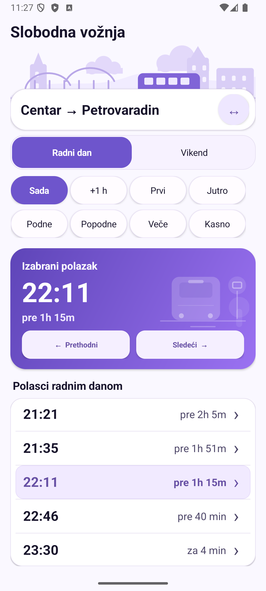

# Slobodna vožnja

Simple offline Android app for checking bus departures between Centar and Petrovaradin.

## Features

- Centar → Petrovaradin and Petrovaradin → Centar
- Weekday / weekend timetable
- Fast presets: now, first bus, morning, noon, afternoon, evening, late
- Offline timetable stored locally
- Downloadable APK from GitHub Releases

## Download

Download the latest APK from the Releases section. [Releases](https://github.com/Vialov/slobodna-voznja/releases)

## Screenshots

## Development

Built with Kotlin and Jetpack Compose.